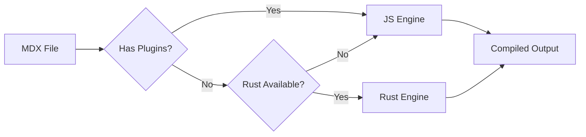

# About MDX Hybrid

MDX Hybrid is a revolutionary approach to MDX compilation that combines the best of both worlds:

- **Rust Engine**: Blazing-fast compilation for standard MDX files
- **JavaScript Engine**: Full compatibility with the MDX ecosystem

## How It Works

## Benefits

### For Development
- ⚡ Faster hot reloading
- 🔧 Full plugin support when needed
- 🎯 Zero configuration required

### For Production
- 🚀 5-10x faster builds
- 📦 Smaller memory footprint
- ✅ Same output quality

## Technical Details

The Rust engine is built with:
- `mdxjs-rs`: Rust implementation of MDX
- `napi-rs`: Node.js bindings
- Pre-built binaries for all major platforms

The JavaScript engine wraps:
- `@mdx-js/mdx`: The official MDX compiler
- Full remark/rehype ecosystem support

## Get Started

Check out our [examples](/) to see MDX Hybrid in action!