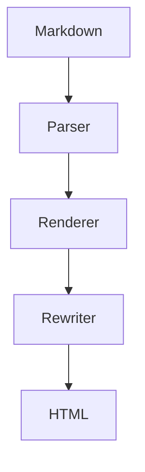

# Architecture Overview

Markflow is composed of a Rust core, NAPI bindings, and a WASM bridge. This page mirrors the withastro/docs architecture article and includes longer content to stress the streaming pipeline.

## Streaming Pipeline

1. Parse markdown via `markdown-rs` into custom events.
2. Pipe events into the HTML renderer, preserving MDX constructs.
3. Feed rendered HTML into `lol_html` for streaming rewrites (lazy images, directives, etc.).

### Directive Simulation

> :::note
> Frontmatter, directives, and embedded JSX must be preserved exactly across the NAPI/WASM boundaries.
> :::

Inline math such as $E=mc^2$ and block math:

$$\int_{-\infty}^{\infty} e^{-x^2} dx = \sqrt{\pi}$$

Need to remain intact after streaming.
